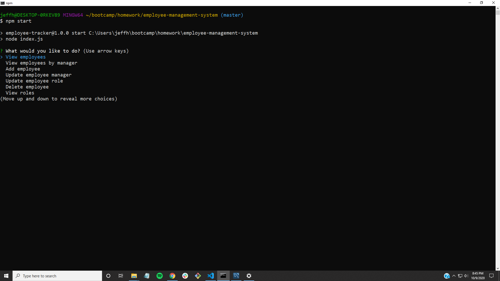

# Employee Management System

## Table of Contents
- [Description](#description)
- [Installation](#installation)
- [Usage](#usage)
- [License](#license)
- [Contributing](#contributing)
- [Tests](#tests)
- [Questions](#questions)
- [Demo](#demo)

## Description

Employee Management System is a command-line application that allows users to add, view and delete employees, roles and departments. The user may also view employees by manager, update employee roles and managers, and view department budgets. 

## Installation

To install dependencies, run the following command:

```
npm i
```

## Usage

Requirements to use EMS: Node.js, MySQL 

## License

No license required

## Contributing

To contribute to this project perform a Github fork

## Tests

No tests required

## Questions

If you have any questions you can contact me direct at <jeffhogg86@gmail.com>. Check out my other repositories at [bosshogg86](https://github.com/bosshogg86).

[](https://github.com/bosshogg86)

[](https://twitter.com/JeffHogg86)

## Demo

https://youtu.be/Q0OTzku_nSs

[](https://youtu.be/Q0OTzku_nSs 'EMS Demo')